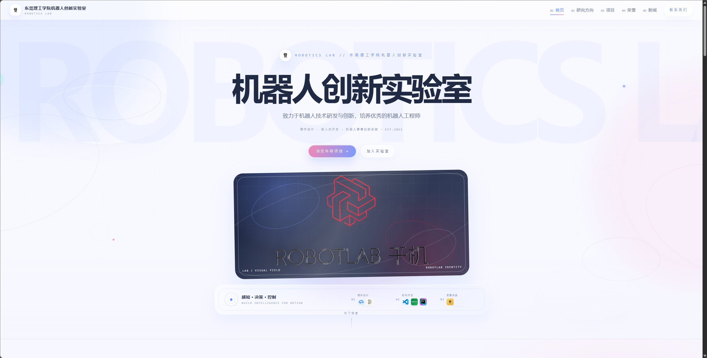
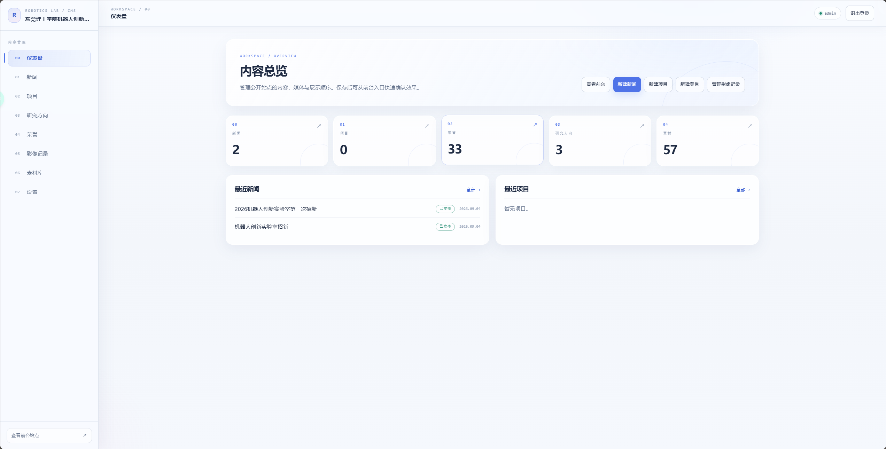

# 东莞理工学院机器人创新实验室

这是一个面向大学机器人实验室的宣传网站与内容管理系统，包含公开官网、管理员后台、FastAPI CMS 接口和 PostgreSQL 数据库。网站以机器人研发、竞赛成果和实验室动态为核心内容，提供沉浸式首页、研究方向、项目、荣誉、新闻和影像记录页面。


## 界面与内容预览

首页和管理后台分别承担展示与运营工作：官网负责呈现实验室品牌和成果，后台负责维护新闻、荣誉、影像记录、素材和网站设置。下面是当前项目的实际界面截图。

### 官网首页



### 管理后台



仓库内同时保留了脱敏后的 CMS 媒体快照，首次部署时可作为演示数据使用；生产环境可以在素材库中替换为正式图片。

## 动画与交互

官网的视觉节奏参考数字展览和机器人控制台，而不是传统信息门户：

- Hero 区使用滚动驱动的 `ROBOTICS LAB` 背景字、轻量视差和轨道线条，滚动时保持缓慢的空间位移。
- 导航栏在页面滚动后保持可见，并通过透明度、位移和当前章节指示器完成状态切换。
- 研究方向使用节点式条目和渐进式 Reveal 动画，让“问题 → 场景 → 项目”按滚动进入视口。
- 精选荣誉和影像记录采用横向滚动轨道，支持鼠标拖动、触摸滑动、键盘方向键和带过渡动画的左右按钮。
- 图片卡片使用轻微的缩放、倾斜和边框高光反馈；大图采用懒加载，避免一次性加载全部媒体。
- 动画优先使用 CSS transform、opacity、IntersectionObserver 和少量 requestAnimationFrame，减少 React 高频重渲染。
- 检测到 `prefers-reduced-motion` 时会自动降低位移和过渡效果，移动端也会减少不必要的重型动效。

## 主要功能

- 官网：`/`、`/research`、`/projects`、`/awards`、`/news`、`/gallery`
- 管理后台：`/admin/login`、`/admin`、新闻、项目、研究方向、荣誉、影像记录、素材库和网站设置
- 荣誉和影像记录支持媒体关联、排序、显示/隐藏和首页精选数量配置
- 首页精选荣誉与影像记录数量可在后台分别设置，范围为 1–20 条
- 图片通过素材库上传和复用，内容记录只保存媒体 ID，不直接保存文件
- OpenAPI 契约位于 [`contracts/openapi.json`](contracts/openapi.json)，是前后端唯一正式接口约定

## 技术栈

- Next.js 16、React 19、TypeScript
- Tailwind CSS 4
- FastAPI、SQLAlchemy 2、Alembic
- PostgreSQL（部署）/ SQLite（本地测试）
- Docker Compose：前端、后端、数据库分别运行在私有网络中
- pnpm、Vitest、Pytest

## 本地运行前端

```powershell
pnpm install
Copy-Item .env.example .env.local
pnpm dev
```

默认实时模式需要后端服务运行。如果只进行前端视觉开发，可以在 `.env.local` 中显式设置：

```dotenv
NEXT_PUBLIC_API_MODE=mock
```

Mock 模式使用确定性测试数据；管理员登录账号为 `admin`，密码为 `admin123`。需要验证后台修改同步到官网时，请使用实时 API 模式。

## 本地运行后端

```powershell
python -m venv .venv
.\.venv\Scripts\Activate.ps1
pip install -r backend/requirements.txt
$env:DATABASE_URL = "sqlite:///./backend/data/cms.local.db"
alembic -c backend/alembic.ini upgrade head
python backend/scripts/create_admin.py admin "use-a-local-password"
uvicorn app.main:app --app-dir backend --reload
```

后端公开接口统一位于 `/api/v1`，管理接口位于 `/api/v1/admin`，具体请求和响应以 OpenAPI 契约为准。

## Docker 部署

从仓库根目录执行：

```powershell
Copy-Item infra/.env.example infra/.env
# 编辑 infra/.env，替换密钥和数据库密码
docker compose --env-file infra/.env -f infra/docker-compose.yml up --build -d
```

浏览器访问 `http://localhost:3000`，或使用主机的局域网地址和 `FRONTEND_PORT`。三个容器分别为：

| 服务 | 容器端口 | 说明 |
| --- | ---: | --- |
| `frontend` | 3000 | 官网和后台，代理 `/api/v1` |
| `backend` | 8000 | FastAPI CMS，不默认暴露主机端口 |
| `postgres` | 5432 | PostgreSQL，仅在 Docker 私有网络中可访问 |

数据库和上传媒体分别使用 Docker volume 持久化。停止服务时不要使用 `down -v`，除非确定要删除数据卷：

```powershell
docker compose --env-file infra/.env -f infra/docker-compose.yml ps
docker compose --env-file infra/.env -f infra/docker-compose.yml logs -f frontend backend
docker compose --env-file infra/.env -f infra/docker-compose.yml down
```

## 质量检查

前端：

```powershell
pnpm lint
pnpm typecheck
pnpm test
pnpm audit:contract
pnpm build
```

后端：

```powershell
python backend/scripts/check_contract.py
python -m pytest backend/tests
```

## 目录说明

- `src/`：Next.js 官网、后台和组件
- `backend/app/`：FastAPI、模型、服务和 API 路由
- `backend/alembic/`：数据库迁移
- `backend/data/media/`：随仓库提供的脱敏媒体快照
- `contracts/`：OpenAPI API Contract
- `infra/`：Docker Compose、镜像和启动脚本
- `public/`：网站标志、工具图标和 Mock 图片

## 许可与内容说明

仓库中的媒体快照仅用于本项目展示和部署初始化。生产环境请通过后台素材库替换或补充实际媒体，并妥善配置管理员密码、`SECRET_KEY` 和数据库密码。不要提交 `.env`、访问令牌或其他敏感信息。
